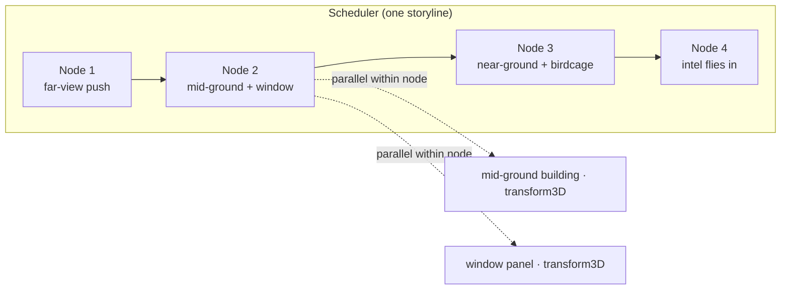
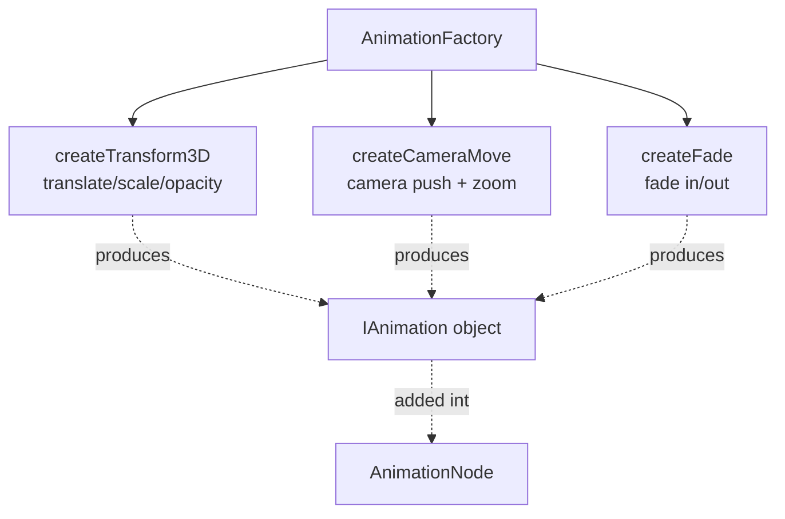
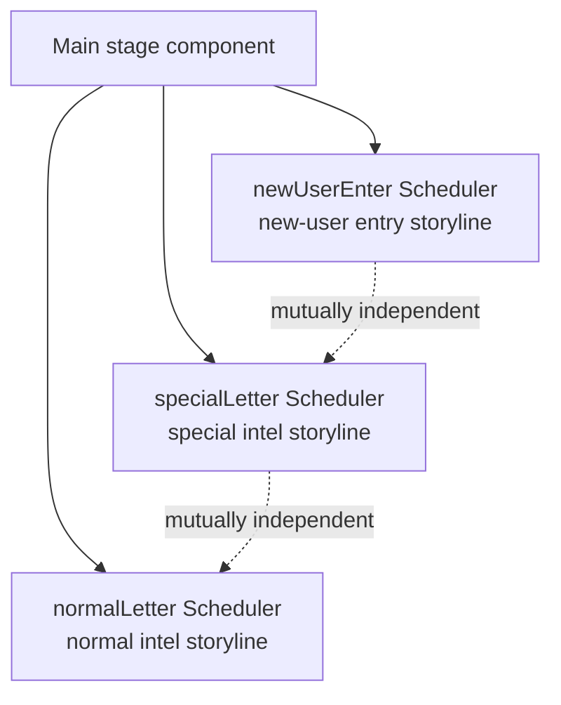
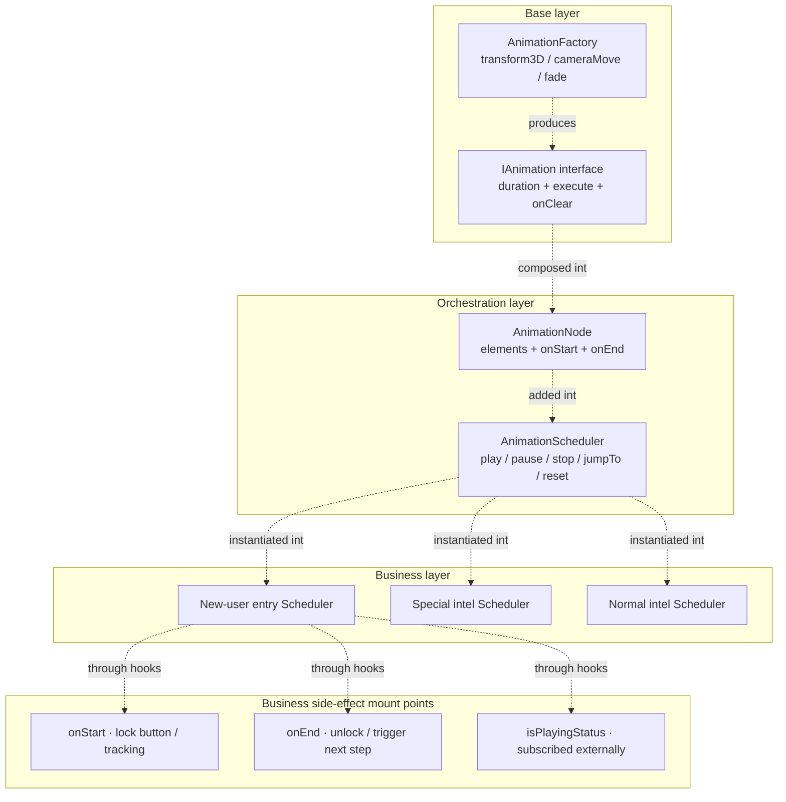

> In a game-IP H5 project, the main stage I owned needed to play **over a dozen animation nodes** in sequence when a user first entered — far-view camera push, mid-ground building placement, near-ground Spine character entrance, Lottie intel flying in, props floating, bubbles popping — and within each node, 3~6 elements were animating at the same time. This animation suite later had to cover three independent storylines: "normal intel", "special intel", and "new-user entry".
>
> I first piled up `setTimeout`s for half a day, then decisively threw them away and wrote a small animation scheduling framework. This post isn't about "what awesome animations I made" — it's about **why I had to stop and get the abstraction right first.**

> **"Resurrected memory"**: amusingly, I can't remember how long ago I first saw Bilibili's homepage header — a multi-layer effect that followed the mouse left/right with apparent depth. I remember thinking: you can do that? That looks amazing! I never imagined that one day I'd use it as a reference in my own project.

---

## 1. Why I had to rewrite

Let me describe the phenomenon first. A story sequence looks like this (simplified):

```
Far-view background starts pushing back →
    wait 300ms →
    mid-ground building drops, while window panels slide from back to front →
        wait 500ms →
        near-ground character Spine enters, birdcage lands at the same time →
            wait 400ms →
            intel Lottie flies in →
            bubble pops
```

At first I hardcoded it with setTimeout, roughly like this:

```javascript
// Anti-pattern (simplified)
setTimeout(() => {
  bgRef.current.style.transform = '...';
  setTimeout(() => {
    houseRef.current.style.transform = '...';
    windowRef.current.style.transform = '...';
    setTimeout(() => {
      spineRef.current.play();
      birdcageRef.current.style.transform = '...';
      // ...
    }, 500);
  }, 300);
}, 0);
```

> ps. At this point the "**resurrected memory**" hadn't hit me yet T_T. It might also be because it was my first time touching game-related development — my basic concepts of animation were still fuzzy, I didn't know how to approach it, and I'd never seen a real implementation. I couldn't even stand to read my own code...

Even during self-testing, this code had already bitten me several times in maintenance:

- **Change one middle node's duration, and the entire chain of delays must be recomputed**
- **Multiple elements animating in parallel at the same instant — readability instantly hits zero**
- **Product casually says "this animation needs a skip" — I stare at the nesting in a daze**
- **Mid-animation I need to attach tracking, lock the main button, notify other components — and I don't know which setTimeout to shove it into**

The kicker — this was just one storyline. The project had two more. **If I didn't abstract, the next animation change would mean editing in three places.**

So I decided to stop and abstract first.

---

## 2. The four concepts I abstracted

Before writing the first line of scheduler code, I split the whole animation storyline into four conceptual layers:

| Concept               | What it is                                                          | Who changes it |
| --------------------- | ------------------------------------------------------------------ | -------------- |
| **IAnimation**        | An async action with a known duration, applied to a DOM element     | Base layer     |
| **AnimationFactory**  | Produces IAnimations from parameters (e.g. "3D translate", "camera push", "fade") | Base layer |
| **AnimationNode**     | A group of element+animation bindings running "in parallel at the same instant", with onStart / onEnd hooks | Orchestration layer |
| **AnimationScheduler**| A queue of nodes, executed serially, supporting play / pause / stop / jumpTo | Orchestration layer |

Their relationship in one sentence:

> **One storyline = one Scheduler = several serial Nodes**
>
> **One Node = several parallel (element × animation) pairs**

Expressed as a diagram:



Once this model was set, that nested-setTimeout block became this:

```typescript
const scheduler = new AnimationScheduler({ autoPlay: false });

scheduler.addNode([{ element: bgEl, animation: cameraMove(...) }]);
scheduler.addNode([
  { element: houseEl,  animation: transform3D(...) },
  { element: windowEl, animation: transform3D(...) },
]);
scheduler.addNode([
  { element: spineEl,     animation: spinePlay(...) },
  { element: birdcageEl,  animation: transform3D(...) },
], { onStart: () => reportExposure('scene_3') });

scheduler.play();
```

**This isn't a "rewrite" — it's turning imperative into declarative.** Change one node's duration and it only affects itself; add a new node and it's one `addNode` line; skip, and it's one `scheduler.stop()`; attach tracking, and it's one `onStart` hook.

---

## 3. Core execution model: one Promise.all is enough

The heart of this framework is really one function — **how to execute a Node**. This is the make-or-break of the whole abstraction:

```typescript
// Core of the Scheduler: serial nodes, parallel within a node
private async executeNode(node: AnimationNode): Promise<void> {
  node.onStart?.();

  // All element animations in the node run in parallel; await the slowest one
  await Promise.all(
    node.elements.map(({ element, animation }) => animation.execute(element))
  );

  node.onEnd?.();
}

// play loop: await nodes one after another, serially
async play(): Promise<void> {
  while (this.isPlaying && this.currentIndex < this.nodes.length) {
    await this.executeNode(this.nodes[this.currentIndex]);
    this.currentIndex++;
  }
}
```

It looks very simple — **but it's exactly this simplicity that freed me from setTimeout nesting entirely.**

Two points worth expanding:

1. **IAnimation knows its own duration.** Its `execute` returns a Promise that resolves when the duration elapses. So the Scheduler never needs to care whether an animation is a CSS transition, Lottie, or Spine — **it just awaits Promises.**
2. **The await between Nodes is serial at the "data-structure level"**, not hard-waited via setTimeout. The significance: whether a node finishes fast or slow, the next node starts right behind it — timing is always accurate.

---

## 4. Animation factory: business never touches DOM styles

The Scheduler only does "orchestration"; what actually applies animations to the DOM is the `AnimationFactory`. I provided three base animations:



The factory's value isn't "how many animation types it supports" — it's that **it gives business a unified API shape**. Business only ever declares:

```
{ translateX, translateY, translateZ, scale, opacity, duration, delay?, before?, onClear? }
```

It never needs to know whether the underlying is `element.style.transition`, `element.style.transform`, or `getComputedStyle`. **The "physical implementation" of animation is encapsulated in the factory** — later, when I wanted to change the easing function once, I only changed the factory, not the business code.

---

## 5. The real pitfalls happened on the "business side effects" line

After the framework ran, the first few commits went smoothly — until I started plugging it into real business. The pitfalls erupted, almost all at the junction of "animation and business state".

### 5.1 Pit 1: The main button could be clicked repeatedly during animation

User taps main button → story animation plays → user taps again → main-button callback fires again → state corruption.

**Root cause**: the Scheduler only plays animations; it has no idea that "business should lock down right now".

**Fix**: I added `onStart` / `onEnd` hooks to Node, letting business decide whether to lock:

```typescript
scheduler.addNode([...], {
  onStart: () => setMainBtnLocked(true),
  onEnd:   () => setMainBtnLocked(false),
});
```

This taught me: **the framework shouldn't make decisions for business — leave the decision to hooks; business can lock however it wants.**

### 5.2 Pit 2: Lottie's playback duration didn't match my declared duration

I declared `duration: 1500`, but the Lottie actually finished at 1800ms. The next node started 300ms early, and frames overlapped.

**Root cause**: Lottie's duration is determined by the file itself; it doesn't obey external duration.

**Fix**: add a `before` callback to IAnimation — business can start the Lottie first, then return a Promise of the "real duration". **The Scheduler doesn't guess duration; it lets the animation report itself.** This change moved the Scheduler from "I control when you end" to "I wait for you to tell me you're done".

### 5.3 Pit 3: Product said "this animation needs a skip"

Users didn't have the patience to watch the full storyline, so product added a "skip" button.

**Without the Scheduler, this requirement would have been a disaster** — setTimeout everywhere, and you could never clean it up properly.

With the Scheduler, it's two lines:

```typescript
scheduler.stop();       // stop playing immediately
scheduler.reset();      // return all elements to initial state
```

**`reset` can return to the initial state because at `addNode` time I used `getComputedStyle` to record each element's original transform / opacity / transition.** I hesitated over this capability when first designing it — seemed unnecessary — but it turned out to be the single most life-saving feature of the whole framework.

### 5.4 Pit 4: During the newbie guide, animations must not be interrupted by business

The newbie guide locks scrolling and taps. But I initially forgot — **even if users can't tap the main button, browser zoom and iOS gesture pull-down can still mess up the DOM state mid-animation.**

**Fix**: the Scheduler exposes a read-only `isPlayingStatus()`, which the newbie-guide component subscribes to: animation playing → disable all external operations; animation ended → unlock.

The real takeaway of this section: **an animation scheduler must provide "current status query" so other business components can make decisions around it.**

---

## 6. Multiple Schedulers coexisting: three storylines on one main stage

On one IP main stage, I ended up maintaining three independent Scheduler instances:



**They never interfere with each other** — each Scheduler has its own node queue, playback state, and hooks. This design meant that when I adjusted the special-intel animation, I never worried about affecting new-user entry; when doing the newbie guide, I only locked one Scheduler, not all of them.

One sentence: **a Scheduler is the atomic unit of "one storyline"; a page can have multiple Schedulers that merely happen to run on the same DOM.**

---

## 7. Whether an abstraction is worth it — how to verify

The biggest difference between writing a framework and writing a business component: **you can't know at the moment you finish writing whether it's over-engineering.** The real verification is the first "new requirement" after launch.

For this Scheduler, the verification moment came when the main stage needed to add **normal intel** and **special intel** — two fully independent storylines — on top of **new-user entry**.

The key choice here was — **I didn't stuff "three storylines" into one Scheduler; I created three independent Scheduler instances.** This choice meant adjusting special intel never risked affecting new-user entry, and during the newbie guide I only locked one Scheduler, not all.

If this abstraction were over-engineering, two signals would appear at this point:

- **Signal A**: the three storylines would have to share state, or they can't run
- **Signal B**: each new storyline would require changing the Scheduler itself

But the actual result — **the Scheduler didn't change a single line.** Business just did `new AnimationScheduler({ autoPlay: false })`, `addNode`, `play` each on its own, and the three storylines ran in parallel.

Only then did I dare say: **stopping to abstract first was the right call.**

As for cross-project, cross-IP reuse potential — I believe it's already there: neither Scheduler nor Factory depends on any business field; moving them to another main stage is technically zero-cost. **But whether reuse actually happens isn't something the framework decides — it depends on the next similar scenario's business judgment.** I'll keep this discussion for the "what I took away" section.

---

## 8. Final architecture overview



---

## 9. What I took away from this framework

Writing a business framework and writing a business component demand entirely different levels of thinking. This experience distilled several judgments for me:

1. **Imperative animation timing is inherently unmaintainable.** Once setTimeout nesting goes beyond two levels, you should start considering abstraction. The value of declarative orchestration isn't "more elegant" — it's "changing one place doesn't affect another".
2. **The framework shouldn't make decisions for business; leave the decisions in hooks.** The three outlets — onStart / onEnd / isPlayingStatus — keep a healthy decoupling between business and animation.
3. **Let animations report their own duration; don't let the framework guess.** Lottie, Spine, and CSS animations have entirely different duration semantics. The framework only awaits Promises and does no duration estimation.
4. **"Being able to undo" is a framework-level feature, not optional.** `reset` depends on recording initial state, which in turn depends on the behavior at `addNode` — **this kind of "seemingly useless capability" often saves you the moment product says "we need a skip".**
5. **One storyline = one Scheduler.** Multiple coexisting Schedulers are the simplest way to keep different storylines from interfering. Don't try to cram everything into one big Scheduler.
6. **A framework's value is truly verified only at the "second call".** At first implementation you can't judge whether it's worth it; only when the main stage needed a second and third storyline, and you ran them without changing a single line of the Scheduler, did you know the abstraction boundaries were drawn right. As for cross-project, cross-IP reuse — that's another level of question: **this framework has that potential, but potential pays off only when the next similar requirement actually lands on your desk.**

---

*This post is distilled from a real project's animation scheduling implementation and iteration commits; business details and IP names have been anonymized.*
