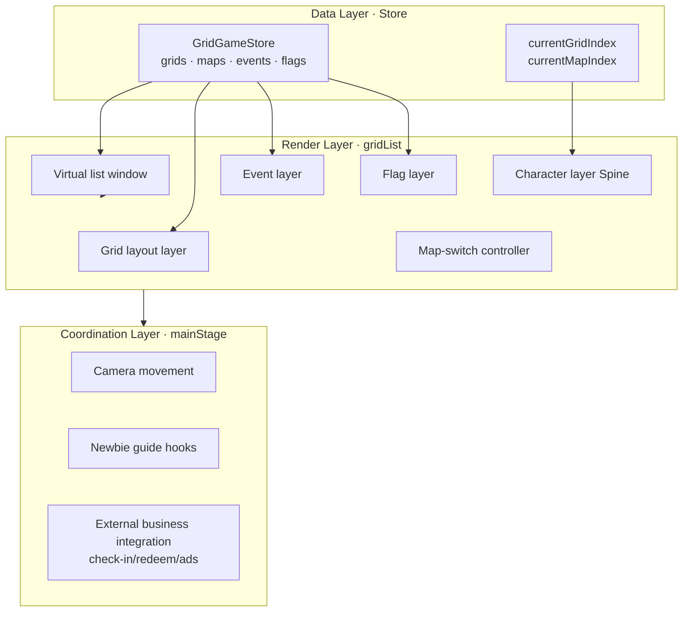
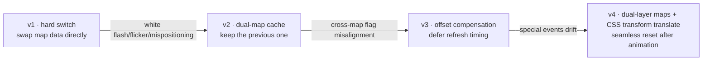
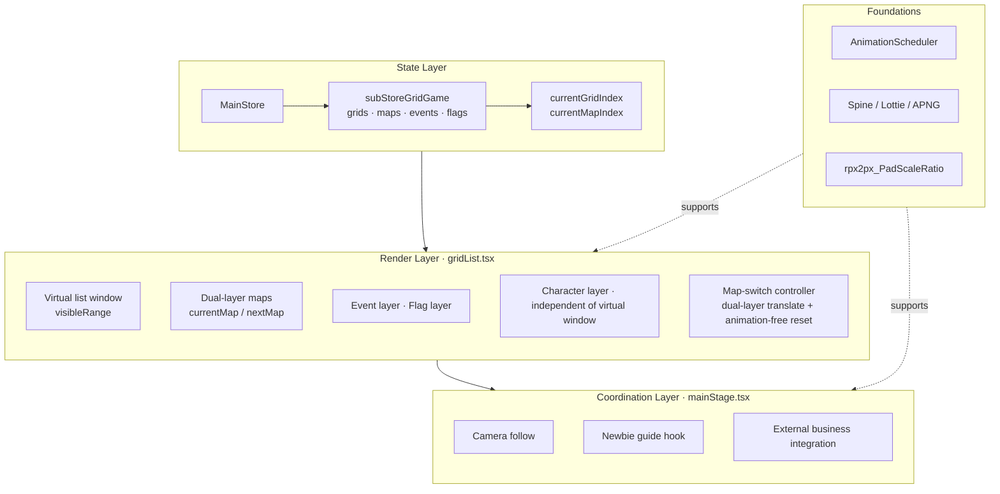

> In a game-IP H5 project I owned, I led the main gameplay engine for a "hopscotch" mechanic from 0 to 1. After launch, this mechanic long sustained the IP's primary retention, and the single-IP daily incremental DAU consistently ranked in the top two within the project. This post isn't about business — it's about architecture decisions: how I reasoned from requirements to a frontend engine that is extensible, reusable, and can absorb the combined complexity of "multi-map, multi-event, multi-animation".

---

## 1. Decomposing the technical architecture from requirements and design

After requirement and design reviews, the gameplay content we settled on looks roughly like this (simplified):

```
Homepage actions: tap interactions / hop / hop to a new map / outfit change / sit down & stand up
Core loop: camera movement after hopping / prop floating / grid effects / first entry
Prop animations: check-in flag drop / burning / flying check-in / streak renewal
```

Even with experience from a previous game project, this is where co-branding with different games gets tricky. Every game's core gameplay is ultimately quite different, and the logic that can genuinely be reused is a handful at best. (And the client's review of co-branded assets and gameplay details is extremely strict.)

Once the direction was set, the frontend was no longer facing "page assembly" but four things:

1. **State**: which grid the character is on, which map is current, whether an event has fired
2. **Layout**: how grids are arranged, what's on screen, what to do with what's off-screen
3. **Animation**: jumps, drops, camera, flags, effects — what runs in what order
4. **Coordination**: newbie guide, check-in, lottery, ads all need to plug into this system

**If you draw these four boundaries clearly in the first version, every future requirement becomes an "addition"; if you don't, you fall into a swamp of technical debt.**

This post is about how I drew those four boundaries — and how I got slapped, refactored, and stabilized at several key turning points.

---

## 2. Architecture planning: define four abstractions first

Before writing a single line of code, I abstracted the design mockup into four concepts:

| Abstraction         | Responsibility                                                | Who changes it |
| ------------------- | ------------------------------------------------------------- | -------------- |
| **Grid**            | Logical unit, hosts events / ads / flags / character position | Data layer     |
| **Map**             | A container of a continuous sequence of grids                 | Data layer     |
| **Character**       | Globally unique movable entity, driven by `currentGridIndex`  | State layer    |
| **Event**           | Interactive device attached to a grid (check-in flag, ad, surprise box) | Data layer + Interaction layer |

Then three hard rules:

1. **Single source of state**: the truth of all grids/maps/events lives in one Store; components only subscribe
2. **Render layering**: grid layer / event layer / flag layer / character layer / effect layer are each independent
3. **Animation externalized**: reuse the animation render manager the team had already built, controlling Lottie and Spine animations

The overall relationship looks like this:



**The four abstractions split complexity into four independently evolvable lines.** In hindsight, most of the subsequent pitfalls happened at layer boundaries, not inside the layers. That's the value of abstraction.

---

## 3. MVP: get "hopping" working first

For the first runnable version, I did only one thing: **the character can hop from grid A to grid B, and the camera follows.**

It progressed in 5 steps:

1. Set up the main-stage skeleton (an empty container)
2. Build `GridGameStore` and compute grid node coordinates
3. Move the character with `currentGridIndex`
4. Integrate the Spine jump animation
5. Add special grids (ad / fade-out) to verify extensibility

**The single most important thing in this phase was locking down the data model. These few interfaces below later supported the entire engine:**

```typescript
// Core data model of GridGameStore (simplified)
interface GridNode {
  index: number;        // order of the grid in the map
  x: number;            // coordinate
  y: number;
  event?: EventConfig;  // mounted event (optional)
  flag?: FlagConfig;    // mounted flag (optional)
}

interface MapData {
  mapId: string;
  grids: GridNode[];    // one map = one column of grids
}

// Globally unique drivers
currentGridIndex: number;   // where the character is
currentMapIndex: number;    // which map is current
```

It looks plain, but it was exactly this "plainness" that let me handle complex requirements like "multi-map switching", "cross-map flags", and "hidden events" later on by simply **adding fields** to the structures — without touching the architecture.

There's nothing exciting to say about the MVP phase — almost every step went smoothly, **because the pitfalls hadn't arrived yet.**

---

## 4. The first architectural surgery: introducing a virtual list

Once the MVP ran, I had to think about how many grids each map needs to load. I hit the problem the same day: rendering all grids made the first screen visibly drop frames, and scrolling felt perceptibly janky.

The DOM count wasn't extreme, but **every grid carried Lottie / APNG / Spine references** — the double pressure of resource loading and GPU compositing layers was the real culprit.

My judgment was quick: **this is a vertical virtual-list problem.** The solution was equally plain:

```typescript
// Render only the visible area + top/bottom buffer
const visibleCount = Math.ceil(SCREEN_HEIGHT / (NODE_HEIGHT + NODE_GAP));
const bufferCount = Math.ceil(BUFFER_HEIGHT / (NODE_HEIGHT + NODE_GAP));

const renderStartIndex = Math.max(0, startIndex - bufferCount);
const renderEndIndex = Math.min(totalNodes, startIndex + visibleCount + bufferCount);
```

**The key decision wasn't "whether to do a virtual list" — it was how to treat the side effects the virtual list brings.**

After this version shipped, three kinds of new problems surfaced, all quite typical in hindsight:

| Symptom                                            | Root cause                                                        |
| -------------------------------------------------- | ---------------------------------------------------------------- |
| Boundary grids appear with a "pop"                 | Buffer too small; fast scrolling outruns rendering                |
| Canvas layer gets culled, clicks pass through      | Character layer (Spine) sits outside the virtual window and gets virtualized |
| Specific grid indices (e.g. #50) behave oddly      | Boundary index ignored the map-end map-switch logic               |

**Lesson from the pit**: what a virtual list must fix is never "rendering" alone — it's "rendering + events + layering" together. I later pulled the character layer out of the grid virtual list and mounted it separately on the outermost layer; only then did these problems truly stop.

One sentence for this section: **any optimization that "renders only a part" must also decide whether the unrendered part still needs to participate in interaction and layering.**

---

## 5. The hardest part: seamless multi-map transitions

If the virtual list was a "performance problem", multi-map switching was **the only problem in this engine that moved the architectural foundation.**

### 5.1 Why it's hard

The requirement was one sentence: "when the character hops to the last grid, automatically enter the next map." Sounds ordinary, but decomposed it looks like this:

- Visually it must look like "a continuous hop" — no white flash, no flicker
- The data source must switch smoothly **mid-hop**, not after the animation ends
- Flags, ads, and event configs all need to recompute positions for the new map
- The character must land correctly on grid 1 of the new map — off by one pixel looks terrible

I iterated 4 versions on this problem, spanning nearly 40 related commits.

### 5.2 The four versions compared



**v1 hard switch**: the most naive — flip `currentMapIndex`, swap the data, and the view jumps instantly. The result: one frame of white flash plus a teleporting character.

**v2 dual-map cache**: keep the previous map's data alongside, trying to have "both present" during the transition. The problem became coordinate-system chaos for flags and events — flags under the previous map's coordinates ended up on the next map's canvas.

**v3 offset compensation + deferred refresh**: precisely control "when to refresh the next map's data". It fixed the flags, but special events (surprise box, ads) still drifted under certain conditions.

**v4 final solution**: both maps become independent layers, both translated up in sync with CSS `transform: translateY`; after the animation ends, **reset with `transition: none` (no animation) back to origin, then re-add the transition with `requestAnimationFrame`** — the user sees continuous scrolling, while underneath a "bait-and-switch" happens.

The key code is just a few lines:

```typescript
// 1. Both layers translate up in sync (1s)
setCurrentMapStyle({ transform: `translateY(-${bgHeight}px)`, transition: 'transform 1s ease-out' });
setNextMapStyle({ transform: `translateY(0px)`, transition: 'transform 1s ease-out' });

// 2. Animation ends → reset styles without animation (the key to avoiding flicker)
setTimeout(() => {
  setCurrentMapStyle({ transform: 'translateY(0)', transition: 'none' });
  subStoreGridGame.updateGridNode();  // switch the data source at the same instant

  // 3. Delay one frame before restoring the transition, so the reset doesn't trigger it
  requestAnimationFrame(() => {
    setCurrentMapStyle(prev => ({ ...prev, transform: 'translateY(0)' }));
  });
}, 1000);
```

These three steps — **sync translate → animation-free reset → restore transition one frame later** — are the most valuable lesson of this whole stretch: **every visual transition that crosses state deserves an explicit transition state instead of a hard cut.**

### 5.3 The real insight of this section

Looking back, v1 through v3 spun in place because I kept trying to "make the data switch happen in an instant". Only with v4 did I realize: **the animation itself IS the transition state; the data switch should hide inside the transition, not outside it.**

---

## 6. Newbie guide: the engine makes way for business

This section deserves its own spotlight because it shows **how the boundary between engine and business should be drawn.**

The newbie guide requirements: lock the character position, follow with a spotlight, block grid events, force the camera back. Sounds like a new feature — but if you add `if (isNewbieGuide)` straight into the engine, the engine rots immediately.

My approach was — **the engine only exposes the necessary hooks and state, and the newbie-guide component consumes them from outside**:

- The engine exposes a read-only subscription to `currentGridIndex`
- The engine exposes a `disableEvents(true/false)` switch
- The engine exposes an imperative `moveCameraTo(index)` method
- The newbie-guide component controls the spotlight position, bubble copy, and timing itself

In one sentence: **the engine doesn't know "newbie guide" exists; it only knows "someone asked it to lock down".**

This boundary let the newbie guide go through 4-5 style/timing adjustments afterwards without a single line of change inside the engine.

---

## 7. Stabilization-phase polish

Once stable, the optimizations were mostly "experience-layer" polish:

- **Preload the next map's character asset** — silently fetch resources before the switch; the switch feels instantaneous
- **SSR data-format fallback** — prevent white screens when unpublished task fields are null
- **iPad scaling adaptation** — all coordinate math goes through a unified `rpx2px_PadScaleRatio`, avoiding grid misalignment on iPad
- **Main-button gradient overlay timing** — align the map-switch animation with the main button's show/hide timing

None of these optimizations were individually hard, but they are exactly the kind that matter most in the sense of **"one day you won't remember why you wrote it this way."**

---

## 8. Final architecture overview



---

## 9. What I took away from this engine

Reviewing the whole stretch, what's genuinely worth crystallizing **isn't the code — it's a few judgments**:

1. **The data model is the skeleton of an engine; lock it down before the first line of code.** Get the four abstractions right and future requirements are all field additions; get them wrong and it's endless refactoring.
2. **Render layering matters more than performance optimization.** The virtual list saved my frame rate back then, but what saved me long-term were layering decisions like "character layer independent of the grid layer" — because they prevented 80% of the boundary bugs that followed.
3. **Cross-state transitions deserve an explicit transition state.** The v1→v4 lesson of multi-map switching: hard cuts never fix flicker; only "hiding the switch inside the transition" works.
4. **The engine-business boundary is drawn with hooks, not ifs.** The newbie guide never wrote a single `if` inside the engine — that's the core reason this engine stayed stable long-term.

An engine's value isn't how fancy it is, but **whether, when the next similar requirement arrives, you can extend or reuse its core capability more easily.** In its own lifecycle, this hopscotch engine was already validated once by requirements we never planned for — "multi-map switching", "cross-map flags", "hidden events" — each one an extension mounted independently onto the engine. Whether it can be reused by another IP scenario, we'll only know when the next similar requirement actually lands; but at least those two hours spent drawing that architecture diagram were the highest-ROI two hours of the entire project.

---

*This post distills the architecture and pitfalls from 200+ real commits on a production project; data and business details have been anonymized.*
