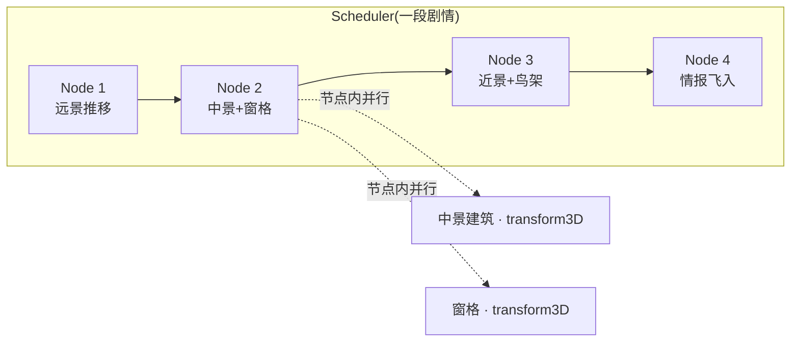
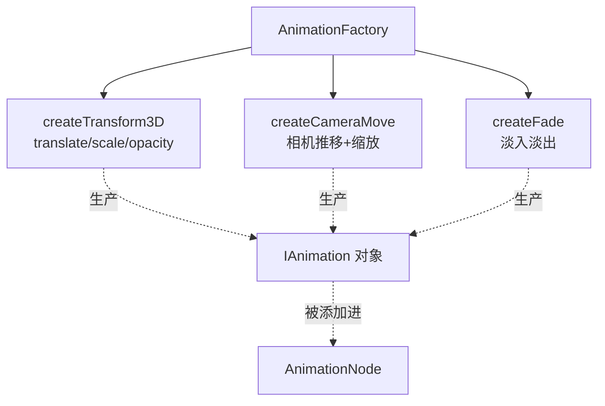
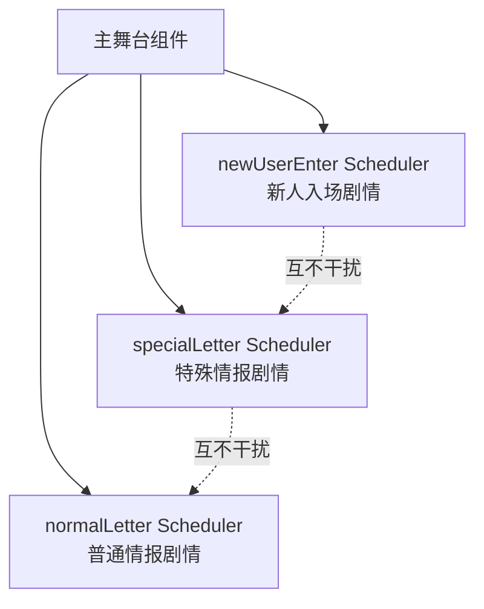
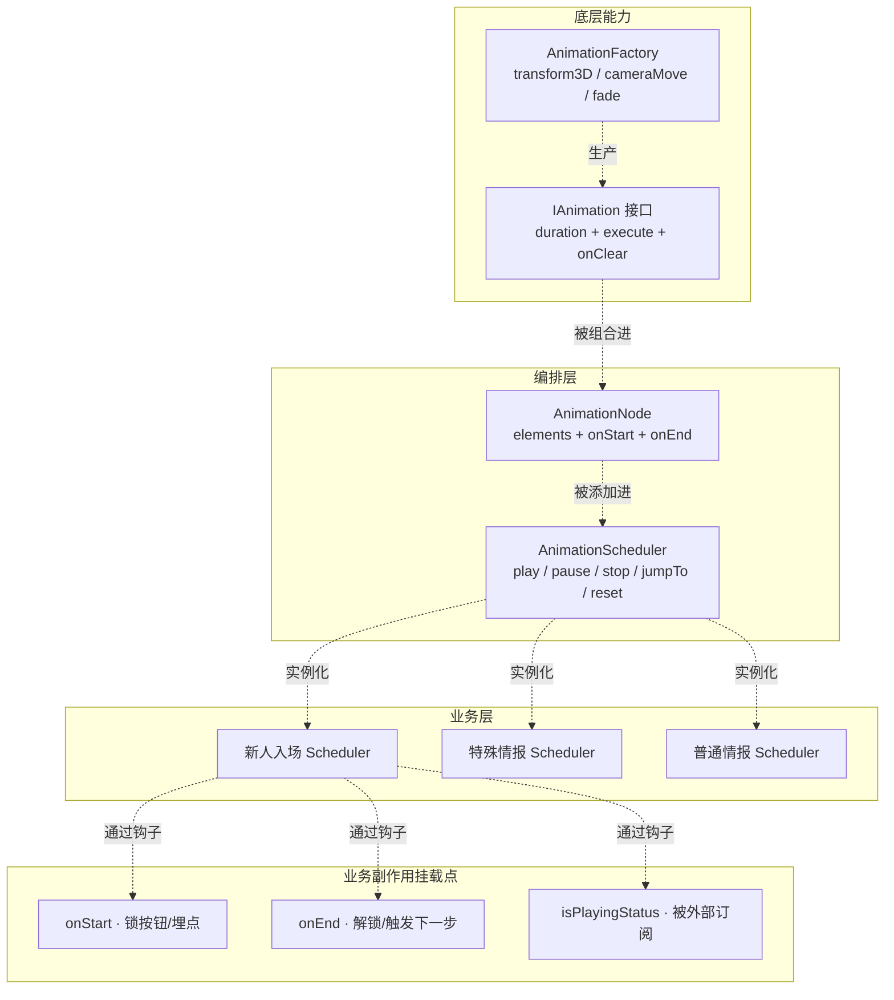

> 在一个游戏 IP H5 项目里，我负责的一个主舞台需要在用户首次进入时，连续播放**十几个动画节点**——远景相机推移、中景建筑落位、近景 Spine 角色登场、Lottie 情报飞入、道具漂浮、气泡弹出——每个节点里又同时有 3~6 个元素在动。这套动画后来还要覆盖"普通情报""特殊情报""新人入场"三条独立剧情。
>
> 我最初用 `setTimeout` 堆叠着写了半天，然后果断推翻了它，写了一个小型的动画调度框架。这篇文章不讲"我做了什么牛逼的动画"，讲的是**我为什么必须停下来，把这套东西的抽象先做对**。

> **"死去的记忆"**：这里有趣的是，我都不记得多久之前，在第一次看到B站主页顶部更新了一个可以跟着鼠标左右滑动——通过多图层实现了一个看起来有景深的动画效果。我当时就感觉，还能这样做？这看着太屌了！没想到有一天，我也能将其作为参考，运用到自己的项目里了。

---

## 一、我为什么必须重写

先描述现象。一段剧情动画长这样(简化)：

```
远景背景开始向后推 →
    等 300ms →
    中景建筑掉落，同时窗格从后景滑到前景 →
        等 500ms →
        近景角色 Spine 登场，鸟架同时落位 →
            等 400ms →
            情报 Lottie 飞入 →
            气泡弹出
```

刚开始我按 setTimeout 硬写，大概是这个样子：

```javascript
// 反面教材(简化)
setTimeout(() => {
  bgRef.current.style.transform = '...';
  setTimeout(() => {
    houseRef.current.style.transform = '...';
    windowRef.current.style.transform = '...';
    setTimeout(() => {
      spineRef.current.play();
      birdcageRef.current.style.transform = '...';
      // ...
    }, 500);
  }, 300);
}, 0);
```

> ps.这个时候"**死去的记忆**"还没有攻击到我T_T，也可能是因为第一次接触游戏相关的开发，对动画什么的基本概念都还很模糊，不知道要怎么处理，没有见过相关的实现。写的自己都看不下去.....

这段代码在自测时，我就已经在维护它上吃过几次亏了：

- **改一个中间节点的 duration，整条链路的 delay 全要重算**
- **多个元素在同一时刻并行动画，可读性瞬间归零**
- **产品临时来一句"要能跳过这段动画"，我看着这堆嵌套发呆**
- **动画中途要挂埋点、要锁主按钮、要通知别的组件，不知道该塞在哪个 setTimeout 里**

关键是——这只是一条剧情。项目里还有另外两条。**如果我不做抽象，下一次改动画就得改三处。**

于是我决定停下，先抽象。

---

## 二、我抽象出的四个概念

在写第一行 scheduler 代码之前，我把整个动画剧情拆成了四层概念：

| 概念                     | 是什么                                         | 谁在改它 |
| ---------------------- | ------------------------------------------- | ---- |
| **IAnimation**         | 一个已知 duration 的、能作用在 DOM 元素上的异步动作           | 底层   |
| **AnimationFactory**   | 根据参数生产 IAnimation(如"3D 平移""相机推移""淡入淡出")     | 底层   |
| **AnimationNode**      | 一组"同一时刻并行执行"的元素+动画绑定，附带 onStart / onEnd 钩子  | 编排层  |
| **AnimationScheduler** | 一个节点队列，串行执行，支持 play / pause / stop / jumpTo | 编排层  |

一句话说清楚它们的关系：

> **一段剧情 = 一个 Scheduler = 若干个串行的 Node**
>
> **一个 Node = 若干个并行的(元素 × 动画)对**

用图表达：



这个模型定下来之后，前面那段嵌套 setTimeout 就变成了这样：

```typescript
const scheduler = new AnimationScheduler({ autoPlay: false });

scheduler.addNode([{ element: bgEl, animation: cameraMove(...) }]);
scheduler.addNode([
  { element: houseEl,  animation: transform3D(...) },
  { element: windowEl, animation: transform3D(...) },
]);
scheduler.addNode([
  { element: spineEl,     animation: spinePlay(...) },
  { element: birdcageEl,  animation: transform3D(...) },
], { onStart: () => reportExposure('scene_3') });

scheduler.play();
```

**这不是"重写"，这是把命令式改成了声明式**。改一个 node 的 duration，只影响自己；加一个新节点，`addNode` 一行；想跳过，`scheduler.stop()` 一句；想埋点，`onStart` 一个钩子。

---

## 三、核心执行模型：一个 Promise.all 就够了

这套框架的核心其实只有一个函数——**如何执行一个 Node**。这是整个抽象能不能立住的关键：

```typescript
// Scheduler 的核心:节点串行，节点内并行
private async executeNode(node: AnimationNode): Promise<void> {
  node.onStart?.();

  // 节点内所有元素动画并行执行，等最慢的那个结束
  await Promise.all(
    node.elements.map(({ element, animation }) => animation.execute(element))
  );

  node.onEnd?.();
}

// play 循环:一个节点接一个节点串行 await
async play(): Promise<void> {
  while (this.isPlaying && this.currentIndex < this.nodes.length) {
    await this.executeNode(this.nodes[this.currentIndex]);
    this.currentIndex++;
  }
}
```

看起来非常简单——**但正是这份简单让我彻底摆脱了 setTimeout 嵌套**。

值得展开讲的两点：

1. **IAnimation 自己知道自己的 duration**。它的 `execute` 返回一个 Promise，在 duration 到期时 resolve。这样 Scheduler 完全不需要关心某个动画是 CSS transition 还是 Lottie 还是 Spine——**它只 await Promise**。
2. **Node 之间的 await 是"数据结构层面"的串行**，不是靠 setTimeout 硬等。这个改变的意义在于：任何一个节点动画完成得快或慢，下一个节点都会紧跟着开始，时序永远准。

---

## 四、动画工厂:让业务不用碰 DOM 样式

Scheduler 只负责"编排"，真正把动画作用到 DOM 上的是 `AnimationFactory`。我提供了三种基础动画:



工厂的价值不在于"支持多少动画类型"，而在于**它给了业务方一个统一的 API 形状**。业务方永远只声明:

```
{ translateX, translateY, translateZ, scale, opacity, duration, delay?, before?, onClear? }
```

它不需要知道底层是 `element.style.transition` 还是 `element.style.transform` 还是 `getComputedStyle`。**动画的"物理实现"被封装在了工厂里**，后来我想统一改一次缓动函数，只需要改工厂，不用动业务代码。

---

## 五、真正的踩坑，发生在"业务副作用"这条线上

框架跑起来之后，前几个 commit 我都很顺——直到我开始把它塞进真实业务。踩坑集中爆发，几乎全部与"动画和业务状态的交界处"有关。

### 5.1 坑一：主按钮在动画期间可以被反复点击

用户点了主按钮 → 播剧情动画 → 用户又点了一次 → 主按钮回调再触发一次 → 状态错乱。

**根因**：Scheduler 只负责放动画，不知道"业务这时候应该锁"。

**解法**：我在 Node 上加了 `onStart` / `onEnd` 钩子，让业务方自己决定要不要锁：

```typescript
scheduler.addNode([...], {
  onStart: () => setMainBtnLocked(true),
  onEnd:   () => setMainBtnLocked(false),
});
```

这一次让我意识到：**框架不要替业务做决定，把决定权留给钩子，业务爱怎么锁怎么锁。**

### 5.2 坑二：Lottie 播放时长和我声明的 duration 对不上

我声明 `duration: 1500`，但 Lottie 实际播完 1800ms。结果下一个节点提前 300ms 开始，画面重叠。

**根因**：Lottie 的时长由文件本身决定，不受外部 duration 控制。

**解法**：在 IAnimation 里加 `before` 回调，业务可以先启动 Lottie 再返回一个"真实时长"的 Promise。**Scheduler 不猜时长，让动画自己报**。这个改动让 Scheduler 从"我控制你多久结束"变成"我等你告诉我你结束了"。

### 5.3 坑三：产品说"要能跳过这段动画"

用户没耐心看完整段剧情，产品加了"跳过"按钮。

**如果没有 Scheduler，这个需求就是灾难**——setTimeout 满地飞，你根本 clear 不干净。

有了 Scheduler，这就是一行：

```typescript
scheduler.stop();       // 立即停止播放
scheduler.reset();      // 所有元素回到初始状态
```

**`reset` 能做到"回到初始状态"，是因为我在 addNode 的时候就用 `getComputedStyle` 记录了元素的原始 transform / opacity / transition**。这个能力我最初设计的时候有过犹豫——好像用不到——事实证明这是全框架最救命的一个功能。

### 5.4 坑四：新手指引期间，动画不能被业务打断

新手指引会锁滚动、锁点击。但我一开始忘了——**用户即使不能点主按钮，浏览器缩放、iOS 手势下拉，依然可能让动画中的 DOM 状态被搞乱**。

**解法**：Scheduler 提供了 `isPlayingStatus()` 只读态，让新手指引组件订阅它：动画在播 → 禁用一切外部操作；动画结束 → 解锁。

这一段真正的收获是：**动画调度器要提供"当前状态查询"的能力，别的业务组件才能围着它做决策。**

---

## 六、多 Scheduler 并存：一段主舞台上跑三条剧情

一个 IP 主舞台上，我最后维持了三个独立的 Scheduler 实例：



**它们互不干扰**，每个 Scheduler 都是自己的节点队列、自己的播放状态、自己的钩子。这个设计让我在做特殊情报动画的调整时，完全不用担心影响到新人入场；做新手指引的时候，只需要锁住一个 Scheduler，不用锁全部。

一句话：**Scheduler 是"一段剧情"的原子单元，一个页面可以有多个 Scheduler，它们只是恰好都跑在同一个 DOM 上而已。**

---

## 七、抽象是否值得，靠什么来验证

写框架和写业务组件最大的区别在于——**你没法在写完的当下，就知道它是不是过度设计**。真正的验证，是它上线之后的第一次"新增需求"。

对这套 Scheduler 而言，验证的时刻是：主舞台需要在**新人入场**之外，再加上**普通情报**和**特殊情报**两条完全独立的剧情线。

这里的关键选择是——**我没有把"三条剧情"塞进一个 Scheduler**，而是**开了三个独立的 Scheduler 实例**。这个选择让我在做特殊情报的调整时，不用担心影响新人入场；新手指引期间只锁住一个 Scheduler，不用锁全部。

如果这套抽象是过度设计，这时候就会出现两个信号：

- **信号 A**：三条剧情不得不共享状态，不然就跑不起来
- **信号 B**：每加一条剧情，Scheduler 本身都要改代码

而实际结果是——**Scheduler 一行未动**，业务方只是各自 `new AnimationScheduler({ autoPlay: false })`、`addNode`、`play`，三条剧情就并跑了起来。

这时候我才敢说：**当初停下来先做抽象，是对的。**

至于跨项目、跨 IP 的复用潜力，我认为已经具备——Scheduler / Factory 都不依赖任何业务字段，搬到别的主舞台在技术上是零成本的。**但复用是不是真的发生，不是框架自己说了算，而是要看下一个类似场景的业务判断**。这一点我会保留在"我从这套框架里带走的东西"那一节里讨论。

---

## 八、最终架构全景



---

## 九、总结

写一个业务框架和写一个业务组件，思考的层次是完全不同的。这段经历让我沉淀了几条判断：

1. **命令式动画时序，天生不可维护**。setTimeout 嵌套超过两层，就应该开始考虑抽象。声明式编排的价值不是"更优雅"，而是"改一处不影响另一处"。
2. **框架不要替业务做决定，把决定权留在钩子里**。onStart / onEnd / isPlayingStatus 这三个口子，让业务和动画之间保持了健康的解耦。
3. **让动画自己报告时长，而不是框架去猜**。Lottie / Spine / CSS 动画的时长语义完全不同，框架只 await Promise，不做时长估算。
4. **"能撤销"是框架级功能，不是可选项**。`reset` 依赖初始状态记录，记录初始状态又依赖 addNode 时的行为——**这类"看似用不到的能力"，往往在产品说"要能跳过"的那一刻救命**。
5. **一段剧情 = 一个 Scheduler**。多 Scheduler 并存，是让不同剧情互不干扰的最简单方式，不要试图用一个大 Scheduler 装下所有。
6. **框架的价值，要在"第二次调用"时才被真正验证**。第一次实现时你判断不了它值不值；直到主舞台上要跑第二条、第三条剧情线，你没动 Scheduler 一行代码就把它们跑起来了，你才知道当初抽象的边界划对了。至于跨项目跨 IP 的复用，是另一个层级的问题——**这套框架具备了那个潜力，但潜力兑现，要等到下一个类似需求真的落到你桌上**。

---

*本文基于本人真实项目的动画调度实现与迭代 commit 提炼，业务细节和 IP 名称已作脱敏处理。*
