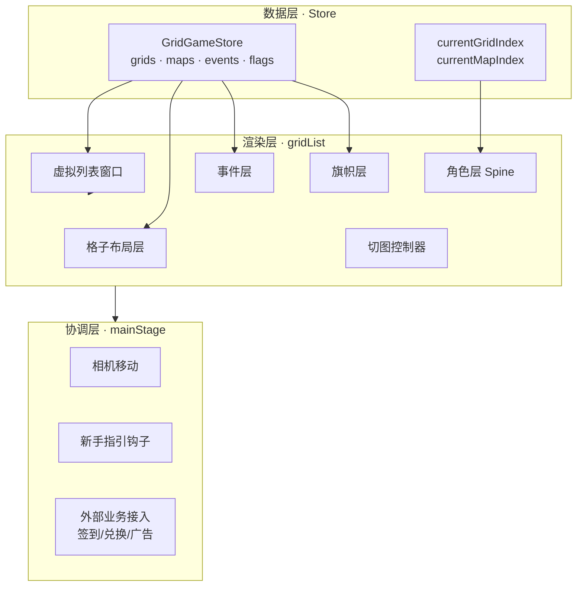
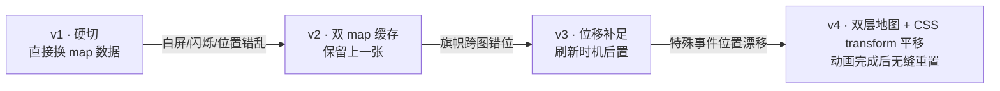
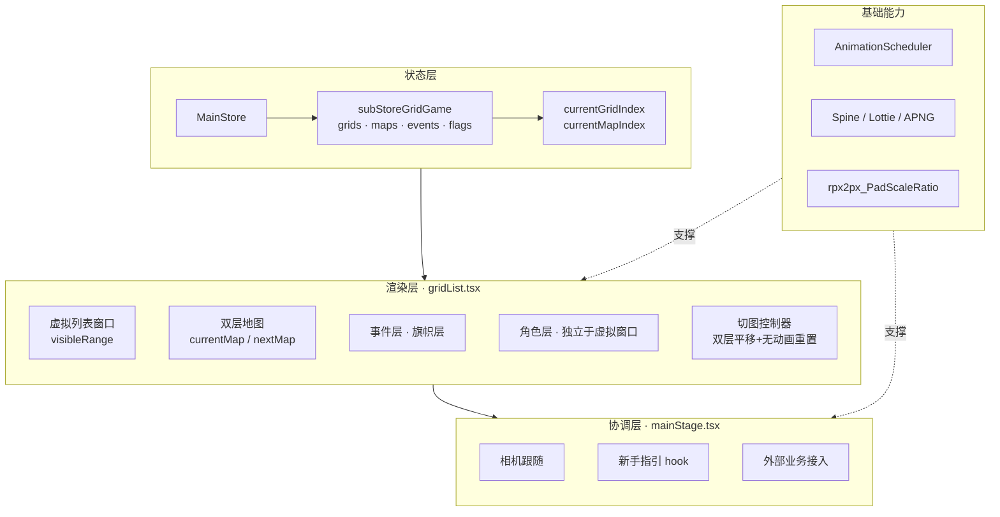

> 我在负责的一个游戏 IP H5 项目里，主导了"跳格子玩法"从 0 到 1 的整个主玩法引擎。这套玩法上线后长期支撑该 IP 的主要留存，单个 IP 日增量 DAU 在项目内长期排名前二。这篇文章不谈业务，只谈架构决策——记录我是怎么把需求，推演成一个可扩展、可复用、能撑住"多地图、多事件、多动画"叠加复杂度的前端引擎。

---

## 一、通过需求和设计拆解技术架构

通过需求和设计评审，总结后，得到的游戏玩法内容大致是这样(简化后):

```
主页动作:点击交互 / 跳一跳 / 跳新地图 / 换装 / 坐下站起
核心链路:跳格子后的镜头移动 / 道具漂浮 / 格子特效 / 首次进入
道具动画:签到旗帜掉落 / 燃烧 / 飞打卡 / 连签换新
```

虽然有了前一个游戏项目的经验，但是这也是跟不同游戏联名麻烦的地方。每个游戏的核心玩法终归是会有较大的差距，有效能复用的逻辑还是屈指可数。（并且甲方对合作的素材，玩法各种环节的审核都是非常严格的）

确定好方向之后，前端要面对的就不是"页面拼装"，而是四件事:

1. **状态**：角色现在在哪个格子、地图切到第几张、事件是否已触发
2. **布局**：格子怎么排、屏幕上要显示哪些、看不见的怎么办
3. **动画**：跳跃、掉落、镜头、旗帜、特效，谁先谁后
4. **协同**：新手指引、签到、抽奖、广告都要往这套系统里塞

**如果第一版就把这四件事的边界划清，后面所有需求都会是"加法"；划不清，就会掉进屎山深渊。**

这篇文章讲的就是我怎么划这四条边界，又是怎么在几个关键节点上被打脸、重构、再稳定的。

---

## 二、架构规划：先定四个抽象

在写一行代码之前，我先把设计稿抽象成了四个概念:

| 抽象            | 承担                                | 谁在改它      |
| ------------- | --------------------------------- | --------- |
| **Grid**      | 逻辑单元，承载事件/广告/旗帜/角色位置              | 数据层       |
| **Map**       | 一组连续格子的容器                         | 数据层       |
| **Character** | 全局唯一可移动实体，由 `currentGridIndex` 驱动 | 状态层       |
| **Event**     | 挂在格子上的可交互装置(签到旗、广告、惊喜盒)           | 数据层 + 交互层 |

再定三条硬性纪律:

1. **状态单点**：所有格子/地图/事件的真相在一个 Store 里，组件只订阅
2. **渲染分层**：格子层 / 事件层 / 旗帜层 / 角色层 / 特效层 各自独立
3. **动画外置**：复用团队之前沉淀的动画渲染管理器，控制Lottie和Spine动画

整体的关系是这样:



**四个抽象把复杂度切成了四条独立可演进的线**。事实证明，后续大部分坑都发生在层与层的边界上，而不是层的内部。这就是抽象的价值。

---

## 三、MVP：先跑通"能跳"这件事

第一个可运行版本，我只做一件事:**角色能从格子 A 跳到格子 B，镜头跟着走。**

分了 5 步递进:

1. 立主舞台骨架(空的容器)
2. 建 `GridGameStore`，把格子节点的坐标算出来
3. 让角色跟随 `currentGridIndex` 位移
4. 接入 Spine 跳跃动画
5. 加特殊格子(广告/渐隐)验证扩展性

**这一阶段最重要的一件事，是把数据模型定型。下面这几行 interface，后来支撑了整个引擎:**

```typescript
// GridGameStore 的核心数据模型（简化）
interface GridNode {
  index: number;        // 格子在地图中的顺序
  x: number;            // 坐标
  y: number;
  event?: EventConfig;  // 挂载的事件(可选)
  flag?: FlagConfig;    // 挂载的旗帜(可选)
}

interface MapData {
  mapId: string;
  grids: GridNode[];    // 一张地图 = 一列格子
}

// 全局唯一驱动
currentGridIndex: number;   // 角色在哪
currentMapIndex: number;    // 当前是第几张地图
```

看起来很朴素，但正是这份"朴素"让我在后面遇到"多地图切换""跨图旗帜""隐藏事件"这些复杂需求时，都只是往结构里**加字段**，而没有动架构设计。

MVP 阶段没什么好讲的，几乎每一步都很顺——**因为坑还没到。**

---

## 四、第一次架构级动刀：引入虚拟列表

MVP 跑通后，就要开始考虑每张地图需要加载的格子数量。我当天就发现问题：全量渲染格子会让首屏明显掉帧，滑动也肉眼可感的卡。

DOM 数量并不夸张，但**每个格子都挂了 Lottie / APNG / Spine 引用**，资源加载和 GPU 合成层双重压力才是真凶。

我的判断很快：**这就是一个纵向虚拟列表的问题**。方案也很朴素:

```typescript
// 只渲染可视区 + 上下 buffer
const visibleCount = Math.ceil(SCREEN_HEIGHT / (NODE_HEIGHT + NODE_GAP));
const bufferCount = Math.ceil(BUFFER_HEIGHT / (NODE_HEIGHT + NODE_GAP));

const renderStartIndex = Math.max(0, startIndex - bufferCount);
const renderEndIndex = Math.min(totalNodes, startIndex + visibleCount + bufferCount);
```

**关键决策不是"要不要做虚拟列表"，而是——虚拟列表带来的副作用怎么治。**

这一版上线后，冒出了三类新问题，现在回头看都很典型:

| 症状 | 根因                     |
| --------------------- | ---------------------- |
| 边界格子"跳"一下才出现 | buffer 太小，滚动速度快时来不及渲染  |
| canvas 层被切走了导致点击穿透 | 角色层(Spine)不在虚拟窗口内，被虚化了 |
| 特定序号的格子(比如第 50 个)行为异常 | 边界索引没考虑地图末尾的换图逻辑       |

**踩坑收获**：虚拟列表要治的从来不是"渲染"，而是"渲染 + 事件 + 层级"三件一起。我后来把角色层从格子虚拟列表里剥出来，单独挂在最外层，这类问题才彻底消停。

一句话总结这一段：**任何"只渲染一部分"的优化，都要同时想清楚"没被渲染的那部分，还需不需要参与交互和层级"。**

---

## 五、最难的一段：多地图无缝切换

如果说虚拟列表是"性能问题"，那多地图切换就是**这套引擎里唯一一个动过架构底盘的问题**。

### 5.1 为什么难

需求描述只有一句:"角色跳到最后一格，自动进入下一张地图"。听起来平平无奇，但拆下去是这样:

- 视觉上要"看起来像连续跳过去"，不能白屏、不能闪烁
- 数据源要**在跳跃过程中**平滑切换，不能等动画结束才切
- 旗帜、广告、事件配置全部要跟着换图重新计算位置
- 角色要在新地图的第 1 格上正确"落地"，偏一像素都难看

我在这个问题上迭代了 4 版，更新了将近 40 个相关 commit。

### 5.2 四版方案对比



**v1 硬切**：最朴素，把 `currentMapIndex` 一改，数据一换，画面直接跳变。结果就是白屏一帧+角色瞬移。

**v2 双 map 缓存**：同时保留上一张地图数据，试图在过渡期"两张都在"。问题变成了旗帜和事件的坐标系混乱——上一张地图坐标下的旗帜，跑到了下一张地图的画布上。

**v3 位移补足 + 刷新时机后置**：精确控制"什么时候刷新下一张地图数据"。修好了旗帜，但特殊事件(惊喜盒、广告)在特定条件下依然会飘位。

**v4 最终方案**：两张地图作为独立的图层，都用 CSS `transform: translateY` 同步向上平移;动画结束后，**用 `transition: none` 无动画重置回原位、然后再用 `requestAnimationFrame` 加回过渡效果**——用户看到的是连续的滚动，底层其实完成了一次"偷梁换柱"。

关键代码就这几行:

```typescript
// 1. 双层同时向上平移(1s)
setCurrentMapStyle({ transform: `translateY(-${bgHeight}px)`, transition: 'transform 1s ease-out' });
setNextMapStyle({ transform: `translateY(0px)`, transition: 'transform 1s ease-out' });

// 2. 动画结束 → 无动画重置样式(防闪烁的关键)
setTimeout(() => {
  setCurrentMapStyle({ transform: 'translateY(0)', transition: 'none' });
  subStoreGridGame.updateGridNode();  // 同一刻切换数据源

  // 3. 延迟一帧再恢复过渡，避免重置动作触发过渡
  requestAnimationFrame(() => {
    setCurrentMapStyle(prev => ({ ...prev, transform: 'translateY(0)' }));
  });
}, 1000);
```

这三步——**同步平移 → 无动画重置 → 一帧后恢复过渡**——是我在这一段学到的最有价值的一课：**任何"跨状态"的视觉切换，都值得为它设计一个显式的过渡态，而不是硬切。**

### 5.3 这一段真正的启发

我事后复盘，v1 到 v3 都在原地打转，是因为我一直试图"让数据切换发生在一个瞬间"。直到 v4 才想明白：**动画本身就是过渡态，数据切换要藏在过渡态里，而不是在过渡态之外。**

---

## 六、新手指引：引擎给业务让路

这一段值得单独讲，因为它体现了**引擎和业务的边界应该怎么划**。

新手指引的需求：角色位置锁死、光圈跟随、格子事件屏蔽、镜头强制归位。看起来是新增功能，但如果直接往引擎里加 `if (isNewbieGuide)`，引擎马上就烂。

我的做法是——**引擎只暴露必要的 hook 和状态，让新手指引组件在外面消费**:

- 引擎暴露 `currentGridIndex` 的只读订阅
- 引擎暴露 `disableEvents(true/false)` 开关
- 引擎暴露 `moveCameraTo(index)` 命令式方法
- 新手指引组件自己控制光圈位置、气泡文案、时序

一句话：**引擎不知道有"新手指引"这件事，它只知道"有人要求它锁住不动"。**

这个边界让新手指引后续做了 4-5 次样式/时序调整，都没有回改到引擎内部一行代码。

---

## 七、稳定期的收尾优化

进入稳定期后的优化，基本都是"体验层"的打磨:

- **预加载下一张地图的角色形象**——切图前静默拉资源，切图瞬间无感
- **SSR 数据格式兜底**——防止任务未发布字段为 null 时白屏
- **iPad 缩放适配**——所有坐标运算走一个统一的 `rpx2px_PadScaleRatio`，避免 iPad 上格子错位
- **主按钮渐变蒙层消失时机**——切图动画和主按钮显隐时序对齐

这些优化每个都不难，但它们在**总有一天你会想不起来当时为什么这么写**的意义上，是最需要留下来的。

---

## 八、最终架构全景



---

## 九、总结

复盘完这整段，我认为真正值得沉淀下来的**不是代码，是几条判断**：

1. **数据模型是引擎的骨骼，写第一行代码前就要定型**。四个抽象定对了，后续需求全是加字段；定错了，就是不断重构。
2. **渲染分层比性能优化更重要**。虚拟列表当年替我救过帧率，但真正长期救我的是"角色层独立于格子层"这类分层决策——因为它避免了后续 80% 的边界 bug。
3. **跨状态的切换要设计过渡态**。多地图切换 v1→v4 的教训：硬切永远解决不了闪烁，只有"把切换动作藏进过渡里"才行。
4. **引擎和业务的边界，靠 hook 划，不靠 if 划**。新手指引没有在引擎里写一个 `if`，是这套引擎能长期稳定的核心原因。

一套引擎的价值不在于它写得多花哨，而在于**当下一个类似需求来的时候，你能不能更方便的扩展或者复用核心能力**。这套跳格子引擎在自己的生命周期里，已经用"多地图切换""跨图旗帜""隐藏事件"这些一开始没规划到的需求验证过一次——每一次都是独立挂载在这套引擎上的扩展能力。至于它能不能再被另一个 IP 场景复用，那要等到下一个类似需求真的来了才知道；但至少当初画那张架构图花的两个小时，是这整个项目里 ROI 最高的两个小时。

---

*本文架构与踩坑记录基于真实项目本人的 200+ 条 commit 提炼，数据与业务细节已作脱敏处理。*
